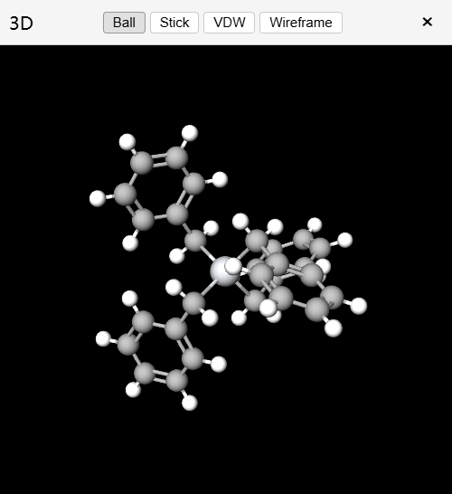

::github{repo="biantailab/MarvinJS"}

# <a href="https://marvinjs.pages.dev" target="_blank">化学结构编辑器 Marvin JS<svg xmlns="http://www.w3.org/2000/svg" style="display:inline;vertical-align:middle;margin-left:2px;color:#e3769b;" width="16" height="16" viewBox="0 0 512 512"><path fill="currentColor" d="M320 0c-17.7 0-32 14.3-32 32s14.3 32 32 32l82.7 0L201.4 265.4c-12.5 12.5-12.5 32.8 0 45.3s32.8 12.5 45.3 0L448 109.3l0 82.7c0 17.7 14.3 32 32 32s32-14.3 32-32l0-160c0-17.7-14.3-32-32-32L320 0zM80 32C35.8 32 0 67.8 0 112L0 432c0 44.2 35.8 80 80 80l320 0c44.2 0 80-35.8 80-80l0-112c0-17.7-14.3-32-32-32s-32 14.3-32 32l0 112c0 8.8-7.2 16-16 16L80 448c-8.8 0-16-7.2-16-16l0-320c0-8.8 7.2-16 16-16l112 0c17.7 0 32-14.3 32-32s-14.3-32-32-32L80 32z"/></svg><a>

<iframe src="https://marvinjs.pages.dev" style="width: 100%; height: 100vh; border: none; border-radius: 10px;margin: 10px auto"></iframe>

# 功能

- smiles 与结构式互相转换
- PubChem 搜索
- HNMR 搜索
- Example:
  - Benzyl titanium
  - Pregabalin
  - Fluoxetine
- 获取 CAS
- 3D 可视化
  - 可移动窗口
  - 可与结构式，smiles 进行实时更新
  - 种类
    |  |  |  |  |
    |---|---|---|---|
